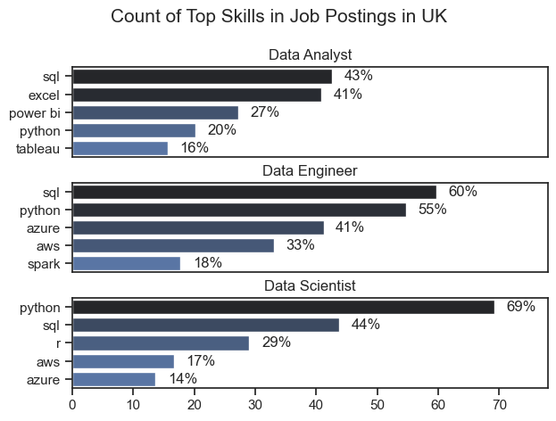

# Overview
Welcome to my analysis of the job market, focusing on data analyst roles. This project was created out of the desire to navigate and understand the job market more effectively. It delves into the top paying and most demanded skills to help find optimal job opportunities for data analysts.

The data sourced from Luke Barousse's Python Course which provides a foundation for my analysis, containing detailed information on job titles, salaries, locations and essential skills. Through a series of Python Scripts, I explore key questions such as the most demanded skills, salary trends, and the intersection of demand and salary in data analytics.

# The Questions
Below are the questions I want to answer in my project:
    1. What are the skills most demanded for the top 3 most popular data roles?
    2. How are the demanded skills trending for Data Analysts?
    3. How well do jobs and skills pay for Data Analysts?
    4. What are the optimal skills for data analysts  to learn? (High demand and High paying)

# Tools I Used
For my deep dive into the data analyst job market, I harnessed the power of several key tools:

- **Python:** The backbone of my analysis, allowing me to analyse the data and find critical insights. I also used the following Python libraries:
    **. Pandas library:** This was used to analyse the data.
    **. Matplotlib library:** I use this to visualize the data
    **. Seaborn Library:** Helped me create more advanced visuals.
**- Jupyter Notebooks:** The tool I used to run my Python scripts which let me easily include notes and analysis.
**- Visual Studio Code:** My go-to for executing my Python scripts.
**Git & Github:** Essential for sharing this informations with you also for collaboration and updating my codes later on

# Data Preparation and Cleanup
I start by imporing necessary libraries and loading database followed by data cleaning which are:
    Converting the date from strings to a time frame using the panda function pd.datetime also coverting the job skills into a usuable list using 'ast'

# The Analysis

## 1. What are the most demande skills for the top 3 most popular data roles 


To find the most demanded skills for the top 3 most popular data roles (Data Analysis, Data Engineer, Data Scientist). I filtered out those positions by which ones are the most popular jobtitles and thier most required skills in US and UK. showing which skills i should pay attention to depending on the role I'm targeting. 

Viewing my notebook with detailed steps here: [2_Skill_Demand.ipynb](3_Project/2_Skill_Demand.ipynb)

## Filtering the job roles and by country from the data
```python
df_UK = df[df['job_country']=='United Kingdom'].copy()
df_US = df[df['job_country']=='United States']
```
## Visualizing Data for UK
``` python
fig, ax = plt.subplots(len(job_titles), 1)
sns.set_theme(style='ticks')

for i, job_title in enumerate(job_titles):
    df_plot_UK = df_skills_perc_UK[df_skills_perc_UK['job_title_short']==job_title].head(5)
    # df_plot_UK.plot(kind='barh', x='job_skills', y='skill_count', ax=ax[i], title=job_title) (changing to seaborn)
    sns.barplot(data=df_plot_UK, x='skills_percent', y='job_skills', ax=ax[i], hue='skill_count', palette='dark:b_r')
    ax[i].set_title(job_title)
    ax[i].set_xlabel('')
    ax[i].set_ylabel('')
    ax[i].set_xlim(0, 78)
    ax[i].legend().set_visible(False)

    for n, v in enumerate(df_plot_UK['skills_percent']):
        ax[i].text(v + 2, n, f'{v:.0f}%', va='center')

    if i != len(job_titles) - 1:
        ax[i].set_xticks([])

fig.suptitle('Count of Top Skills in Job Postings in UK', fontsize=15)
fig.tight_layout(h_pad=0.5)
```
### Result



## Visualizing Data for US (same code format as UK)


## Insights
- Python is a versatile skill, highly demanded across all three roles, but most prominently for Data Scientist (72% in US, 69% in UK) and Data Engineers (65% in US, 55% in UK).
-SQL is the most requested skills for all Data Analyst and Data Engineers, with it in over half the job posting for both roles. for Data Scientist, Python is the most sought after skill appearing in over 69% in both countries for job postings.
-Data Engineers require more specialized technical skill (AWS, Azure, Spark) compared to Data Analysts and Data scientists who are expected to be proficient in more general data management and analysis tools(Excel, Tableau). 


## 2. How are in demand skills trending for Data Analysts?

### Visualize the data for UK
``` python
df_UK_plot = df_DA_UK_percent.iloc[:, :5]

sns.lineplot(df_UK_plot, dashes=False, palette='tab10')
sns.set_theme(style='ticks')
sns.despine()

plt.title('Trending Top Skills fot Data Analyst in the UK')
plt.ylabel('Likehood in Job Posting')
plt.xlabel(2023)
plt.legend().remove()

from matplotlib.ticker import PercentFormatter
ax = plt.gca()
ax.yaxis.set_major_formatter(PercentFormatter(decimals=0))

for i in range(5):
    plt.text(11.2, df_UK_plot.iloc[-1, i], df_UK_plot.columns[i])
```


### Visualize the data for US(same code format as UK)


### Insights:
- SQL remains the most consistently demanded skill throughout the year although it showed a gradual decrease in demand.
-Excel experience a significant increase in demand starting around September, surpassing both python and Tableau by the end of the year.
-Both python andTableau shows relatively stale demand throughout the year with some flunctuations but remain essential skills for data analysis. Power BI, while less demanded compared to the others, shows a slight upward trend towards the year's end

## 3. How well do jobs and skills pay for Data Analysts?

### Salary Insights for Data Roles

### Visualize Data for Uk
``` python
sns.boxplot(data=df_UK_top6, x='salary_year_avg', y='job_title_short', order=job_order_uk)


plt.title('Salary Distribution in the United Kingdom')
plt.xlabel('Yearly Salary ($USD)')
plt.ylabel('')
tick_x = plt.FuncFormatter(lambda y, pos: f'${int(y/1000)}K')
plt.gca().xaxis.set_major_formatter(tick_x)
```


### Visualize Data for US(same code format as UK)


### Insight
- There is a significant variation in salary ranges across different job titles. Senior Data Scientist position tend to have the highest salary Potential with upto $600k, indicating the high value placed on advanced data skills and experience in the the industry
- Senior Data Engineer and Senior Data Scientist roles shows a considerate number of outliers on the higher end of fthe salary spectrum, suggesting that exceptional skills or circumstances can lead to high pay in these roles, In contrast, Data Analyst roles demostrate more consistency in salary with fewer outliers
- The median salary increases with the seniority and specialization of these roles. Senior roles (Senior Data Scintist,Senior Data Engineer) not only have higher median salary but also larger differences in typical salaries, reflecting greater variance in compensationas responsibilityies increases.
### Highest Paid & Most Demanded Skills for Data Analysts
#### Visualize Data for Uk
``` python
fig, ax = plt.subplots(2,1)
sns.set_theme(style='ticks')

#Top Highest Paid Skills for Data Analyst
sns.barplot(data=df_DA_UK_TopPay, x='median', y=df_DA_UK_TopPay.index, ax=ax[0], hue='median', palette='dark:b_r')
ax[0].legend().remove()

ax[0].set_title('Top 10 Highest Paid Skills for Data Analyst in UK')
ax[0].set_ylabel('')
ax[0].set_xlabel('')
ax[0].xaxis.set_major_formatter(plt.FuncFormatter(lambda x, _: f'${int(x/1000)}K'))
#[::-1]

#Top 10 Most IN-Demand Skills for Data Analyst
sns.barplot(data=df_DA_UK_skills, x='median', y=df_DA_UK_skills.index, ax=ax[1], hue='median', palette='light:b')
ax[1].legend().remove()

ax[1].set_title('Top 10 Most In-Demand Skills for Data Analyst in UK')
ax[1].set_ylabel('')
ax[1].set_xlabel('Median Salary (USD)')
ax[1].xaxis.set_major_formatter(plt.FuncFormatter(lambda x, _: f'${int(x/1000)}K'))
ax[1].set_xlim(ax[0].get_xlim())

fig.tight_layout()
```
Here's the breakdown of the Highest paid and Most In Demand Skills for data analyst in UK


#### Visualize Data for Uk (same code format as UK)

Here's the breakdown of the Highest paid and Most In Demand Skills for data analyst in US


### Insights
- The top graph shows specialized technical skill which are associated with higher salaries, some reaching up to $200k, suggesting that advanced technical proficiency can increase earning potential.

- The bottom graph highlights that foundamantal skills are most demanded even though they may not offer the highest salaries. This demostrates the importance of these core skills fro employability in data analysis roles.
- There's a clear distinction between the skills that are highest paid and those that are most demanded. Data analysts aiming to maximize thier career potential should consider developing a diverse skill set that include both high-paying specialized skills and widely demanded foundational skills.

## 4. What is the most optimal skill to learn for Data Analyst in US

#### Visualize Data for Uk
``` python
from adjustText import adjust_text
from matplotlib.ticker import PercentFormatter

sns.set_theme(style='ticks')

# df_plot_US.plot(kind='scatter', x='skills percent', y='median_salary')
sns.scatterplot(
    data=df_plot_UK,
    x='skills percent',
    y='median_salary',
    hue='technology'
)


texts = []
for i,text in enumerate(df_DA_UK_HighDemand.index):
    texts.append(plt.text(df_DA_UK_HighDemand['skills percent'].iloc[i], df_DA_UK_HighDemand['median_salary'].iloc[i], text))

adjust_text(texts, arrowprops=dict(arrowstyle="->", color='gray', lw=2))
ax=plt.gca()
ax.yaxis.set_major_formatter(plt.FuncFormatter(lambda y, pos: f'${int(y/1000)}k'))
ax.xaxis.set_major_formatter(PercentFormatter(decimals=0))

plt.xlabel('Percentage of Data Analyst job In UK')
plt.ylabel('Median Yearly Salary ($USD)')
plt.title('Most Optimal Skill for Data Analyst in UK')

plt.show()
```

*A scatter plot visualizing the most optimal skills (high paying and high demand) for data analyst in the UK*

#### Visualize Data for US(same code format as UK)

*A scatter plot visualizing the most optimal skills (high paying and high demand) for data analyst in the US*

#### Insights:
- The scatter plot shows the most of the programming skills tend to cluster at the higher salary levels compared to other categories, indicating that programming expertise might offer greater salary benefits within the data analytics field.

- Analyst tool, inclding tableau and power BI are prevalent in job postings and offer competitive salaries showing that visualizatiion and data analysis software are crucial for current data roles. This category not only have goodsalaries but also versatile across different types of data tasks

- The database skills as oracle and sql server are associated with some of the highest salaries among data analyst tools. This indicates a significant demand and valuation for data management and manipulation expertise in the industry.

# What I Learned
Throughout this project, I deepened my understading of the data analyst job market and enhanced my technical skills in Python, especially in data manipulation and visualization. Here are a few specific things I learned:

**- Advanced Python usage:** Utilizing libraries such as Pandas for data manipulation, Seaborn and Matplotlib for data visualization, and other libraries helped me perform complex data analysis tasks more effectively.
**- Data Cleaning Importance:** I learned that thorough data cleaning and preparation are crucial before any analysis and should be conducted to ensure the accuracy of insights derived from the data.
**- Strategic Skill Analysis:** The project emphasized th importance of aligning one's skill with market demand. Understanding the relationship between skill demand, salary, and job availability allows for more strategic career planning in the tech industry.

# Insights
This Project provided several general insights into the data job market for analysts:
**- Skill Demand and Salary Correlation:** There is a clear correlation between the demand for specific skills and their salaries these skill command, Advanced and Specialized skills like Python and Oracle often lead to higher salaries.
**- Market Trends:** These are changing trends in skill demand, highlighting the dynamic nature of the data job market, keeping up with these trends is essential for career growth in data analytics.
**- Economic Value of Skills:** Understanding which skills are both high demand and well compensated can guild data analyst in Prioritizing learning to maximize thier economic returns.

# Challenges I Faced
This project was not without its challenges, but it provided good learning opportunities:
**- Data Inconsistencies:** Handling missing or inconsistent data entries require careful consideration and thorough investigation of techniques used to ensure integrity of the analysis
**- Complex Data Visualization:** Designing effectuve visual representations of complex datasets was challenging, but it helps in conveying insights clearly and compelling.
- **Balancing Breadth and Depth:** Deciding how deeply to dive into each analysis while mantaining a broad overview and landscape requires constant balancing to ensure comprehensive coverage without getting lost in details

# Conclusion
This exploration into the data analyst job market has been incredibly informative, highlighting the critical skills and trends that shape this evolving field. The insight I got enhance my understanding and provide actionable guidance or anyone looking to advance their career in data analytics. As the markets continues to change, ongoing analysis will be essential to stay ahead in data analytics. This project is a good foundation for future explorations and underscores the importance of continous learning and adaptation in the data field.